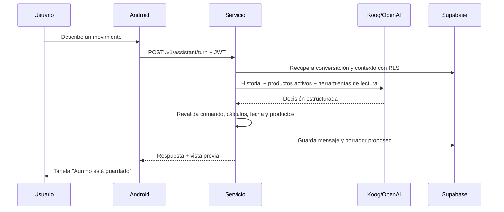

# Chat de texto del asistente

## Objetivo

La primera capacidad interactiva de IA convierte lenguaje natural en una
propuesta financiera revisable. No escribe en Room ni en Supabase y no
presenta una propuesta como si ya estuviera registrada.

El mismo chat también admite saludos, preguntas sobre sus capacidades y
consultas de lectura sobre las finanzas del usuario. Estas respuestas usan el
estado `conversation` y nunca se confunden con una propuesta de escritura.

## Alcance actual

Se soporta el mismo catálogo de comandos financieros del registro manual:

| Grupo | Acciones |
|---|---|
| Movimientos | Ingreso, gasto, transferencia, edición y eliminación |
| Productos | Crear, editar y archivar |
| Tarjetas | Compra a cuotas, promociones, cuota, saldo total y abonos |
| Ahorros | Aporte, retiro, cambio de tasa, cajita y CDT |
| Préstamos | Cuota, saldo total y abono a capital |

La fecha es opcional y toma la hora del servicio cuando el usuario no la
indica. Comercio, nota y categoría también son opcionales. COP y USD son las
monedas admitidas por el dominio actual.

Cada turno recibe los productos activos y el historial reciente completo. Una
respuesta corta como `20000` debe completar los datos ya mencionados, no iniciar
una interpretación nueva. Una referencia parcial como `Bancolombia` se resuelve
automáticamente únicamente cuando existe un producto compatible inequívoco.
Las transferencias son movimientos entre dos productos propios; enviar dinero
a una persona o comercio desde una cuenta se interpreta como gasto.

Las solicitudes que contienen dos escrituras independientes se separan: el
asistente pregunta cuál preparar primero. Crear un producto con su saldo o deuda
inicial sí constituye una sola acción.

## Flujo seguro



El modelo nunca recibe una herramienta de escritura. La confirmación revalida
el estado financiero y ejecuta el mismo `FinancialCommand` usado por las
pantallas manuales.

## Contrato HTTP

Ruta autenticada:

```text
POST /v1/assistant/turn
Authorization: Bearer <supabase_access_token>
Content-Type: application/json
```

Ejemplo:

```json
{
  "conversationId": null,
  "clientMessageId": "11111111-1111-4111-8111-111111111111",
  "content": "Gasté 35000 en almuerzo con Bancolombia",
  "locale": "es-CO",
  "timeZoneId": "America/Bogota"
}
```

`clientMessageId` debe reutilizarse cuando el cliente reintenta el mismo envío.
Una respuesta puede ser `conversation`, `clarification`, `proposal` o
`unsupported`.

La corrección manual de una propuesta no vuelve a pasar por el modelo:

```text
POST /v1/assistant/drafts/{draftId}/revise
Authorization: Bearer <supabase_access_token>
Content-Type: application/json
```

El cuerpo contiene la versión esperada y el `commandPayload` corregido. El
servicio exige el mismo `commandId`, la misma familia de comando y estado
`proposed`; luego actualiza la versión y vuelve a validar el estado financiero.
Android confirma únicamente la versión revisada.

## Comportamiento del chat

1. El cliente agrega el mensaje local y limpia el compositor antes de esperar
   la red.
2. Durante la respuesta muestra un indicador compacto “Analizando…”.
3. Si falla el envío, conserva el mensaje con advertencia y reintenta usando el
   mismo `clientMessageId` para mantener idempotencia.
4. La tarjeta introductoria solo existe antes del primer mensaje.
5. `Cancelar` retira la propuesta inmediatamente y cancela el borrador en
   segundo plano.
6. `Editar` obtiene el comando estructurado, presenta campos dentro de la misma
   tarjeta y usa `/revise`; no crea un nuevo turno ni delega la corrección al
   LLM.
7. El compositor se apoya directamente sobre el IME y la navegación inferior
   se oculta mientras el teclado está visible.
8. Un envío conserva el mismo `clientMessageId` y realiza como máximo tres
   intentos ante red, timeout, `429` o `5xx`, separados por tres segundos.
   Durante todo el ciclo se muestra únicamente “Analizando…”. Los errores
   definitivos aparecen como texto breve junto al mensaje; no se añade un
   segundo indicador bajo la burbuja.
9. La edición permite escoger otro producto compatible desde los productos
   activos locales. El identificador y la moneda seleccionados se incorporan al
   comando revisado antes de confirmarlo.

## Configuración Android

En `apps/mobile/local.properties`:

```properties
ASSISTANT_BASE_URL=https://URL_PUBLICA_DEL_SERVICIO
```

La URL debe ser HTTPS y accesible desde el teléfono. `localhost` en un
dispositivo físico apunta al propio teléfono, no al computador. Para desarrollo
se necesita desplegar el servicio o exponerlo mediante un túnel HTTPS confiable.

Cambiar esta propiedad o cualquier archivo Gradle requiere **Sync Project with
Gradle Files** antes de ejecutar la app.

## Reglas de privacidad y operación

- La clave de OpenAI nunca se agrega a `local.properties`, BuildConfig ni al APK.
- El usuario se deriva del JWT; el body no acepta `userId`.
- Supabase vuelve a aplicar RLS en cada consulta.
- Se envían los nombres, tipos, monedas, identificadores y alias de los
  productos activos para resolver referencias en un solo turno. Movimientos,
  saldos detallados y demás registros solo se consultan mediante herramientas
  cuando son necesarios.
- Los logs no contienen mensajes, tokens ni payloads financieros.
- Los borradores expiran a los 15 minutos.
- Una ambigüedad de producto siempre genera una pregunta.

## Validación de esta fase

1. Gasto completo produce una propuesta y no un movimiento guardado.
2. Ingreso sin producto solicita el producto.
3. Transferencia ambigua solicita nombres más precisos.
4. Monedas distintas impiden una transferencia.
5. Un producto archivado, tarjeta, ahorro o préstamo no se usa como líquido.
6. Reintentar el mismo `clientMessageId` no duplica el turno ni el borrador.
7. JWT ausente o vencido devuelve error autenticado.
8. Tema claro y oscuro conservan contraste, teclado y desplazamiento.
9. `Mandé 20mil a mi novia desde Bancolombia` produce un gasto cuando existe
   un único producto líquido Bancolombia.
10. Una respuesta corta conserva intención, monto y producto de turnos previos.
11. `Hola` y `¿qué puedes hacer?` producen respuestas conversacionales.
12. Una compra a cuotas conserva promociones sin interés sin solaparlas.
13. `Pagué la cuota` deriva el valor desde el estado real de la deuda.
14. Un cambio de tasa de ahorro no crea una entrada o salida de dinero.
15. Crear un CDT exige tasa, apertura y vencimiento válidos.
16. Editar un movimiento preserva todos los campos no mencionados.
17. Una solicitud con dos escrituras solicita elegir cuál preparar primero.
18. Seguridad, privacidad y permisos se cambian únicamente en su pantalla.
