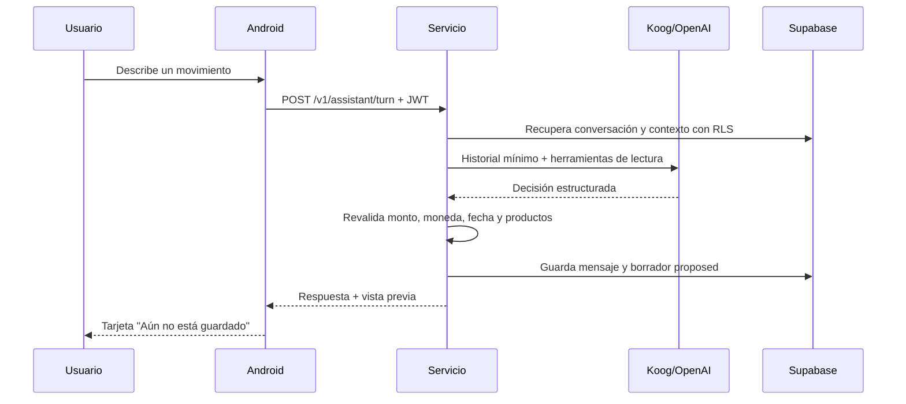

# Chat de texto del asistente

## Objetivo

La primera capacidad interactiva de IA convierte lenguaje natural en una
propuesta financiera revisable. No escribe en Room ni en Supabase y no
presenta una propuesta como si ya estuviera registrada.

## Alcance actual

Se soportan tres intenciones:

| Intención | Datos mínimos |
|---|---|
| Ingreso | monto y producto líquido |
| Gasto | monto y producto líquido |
| Transferencia | monto, origen líquido y destino líquido |

La fecha es opcional y toma la hora del servicio cuando el usuario no la
indica. Comercio, nota y categoría también son opcionales. COP y USD son las
monedas admitidas por el dominio actual.

Tarjetas de crédito, préstamos, ahorros, CDT, creación de productos, edición y
eliminación pertenecen a la fase de paridad completa.

## Flujo seguro



El modelo nunca recibe una herramienta de escritura. La futura confirmación
revalidará el estado financiero y ejecutará el mismo `FinancialCommand` usado
por las pantallas manuales.

## Contrato HTTP

Ruta autenticada:

```text
POST /v1/assistant/turn
Authorization: Bearer <supabase_access_token>
Content-Type: application/json
```

Ejemplo:

```json
{
  "conversationId": null,
  "clientMessageId": "11111111-1111-4111-8111-111111111111",
  "content": "Gasté 35000 en almuerzo con Bancolombia",
  "locale": "es-CO",
  "timeZoneId": "America/Bogota"
}
```

`clientMessageId` debe reutilizarse cuando el cliente reintenta el mismo envío.
Una respuesta puede ser `clarification`, `proposal` o `unsupported`.

## Configuración Android

En `apps/mobile/local.properties`:

```properties
ASSISTANT_BASE_URL=https://URL_PUBLICA_DEL_SERVICIO
```

La URL debe ser HTTPS y accesible desde el teléfono. `localhost` en un
dispositivo físico apunta al propio teléfono, no al computador. Para desarrollo
se necesita desplegar el servicio o exponerlo mediante un túnel HTTPS confiable.

Cambiar esta propiedad o cualquier archivo Gradle requiere **Sync Project with
Gradle Files** antes de ejecutar la app.

## Reglas de privacidad y operación

- La clave de OpenAI nunca se agrega a `local.properties`, BuildConfig ni al APK.
- El usuario se deriva del JWT; el body no acepta `userId`.
- Supabase vuelve a aplicar RLS en cada consulta.
- No se envían todos los registros al modelo: las herramientas consultan solo
  lo necesario.
- Los logs no contienen mensajes, tokens ni payloads financieros.
- Los borradores expiran a los 15 minutos.
- Una ambigüedad de producto siempre genera una pregunta.

## Validación de esta fase

1. Gasto completo produce una propuesta y no un movimiento guardado.
2. Ingreso sin producto solicita el producto.
3. Transferencia ambigua solicita nombres más precisos.
4. Monedas distintas impiden una transferencia.
5. Un producto archivado, tarjeta, ahorro o préstamo no se usa como líquido.
6. Reintentar el mismo `clientMessageId` no duplica el turno ni el borrador.
7. JWT ausente o vencido devuelve error autenticado.
8. Tema claro y oscuro conservan contraste, teclado y desplazamiento.
