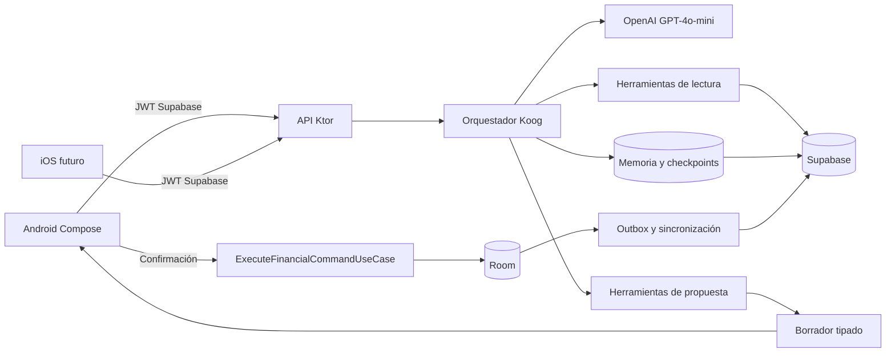
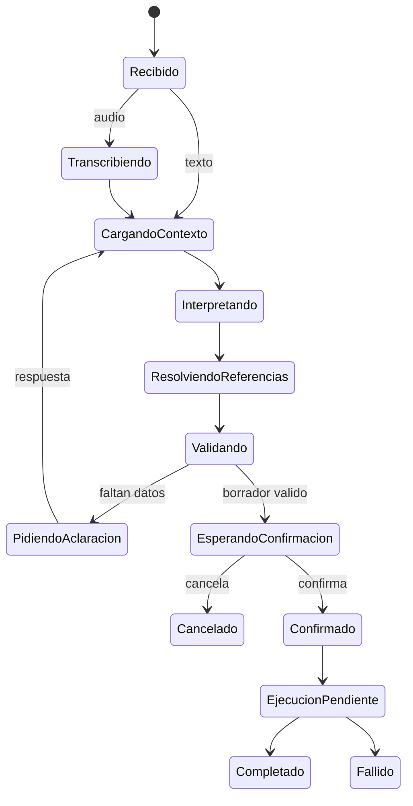

# Guía de implementación del asistente de IA

> Estado: fases 0 a 4 implementadas y validadas; la migración de memoria está
> aplicada en Supabase.
> Alcance: texto y voz a texto para ejecutar, con confirmación, todas las
> operaciones financieras disponibles manualmente en PocketMind.

## 1. Objetivo

PocketMind debe permitir que una persona gestione sus finanzas escribiendo o
hablando en lenguaje natural, sin perder precisión, trazabilidad ni control.

Ejemplos:

- «Compré un almuerzo de 35.000 con mi cuenta Bancolombia».
- «Me pagaron 800.000 de un trabajo a la cuenta de Nu».
- «Pagué la cuota de la tarjeta».
- «Compré un computador a 12 cuotas; las primeras 3 no tienen intereses».
- «Abrí una cajita en Nu al 11 % E.A. y puse 80.000».
- «Abrí un CDT de Bancolombia al 11 % E.A., a 6 meses, por 2 millones».

La IA no sustituye las reglas financieras. Interpreta la intención, resuelve
referencias, solicita información faltante y crea una propuesta estructurada.
El dominio de PocketMind valida, calcula y ejecuta la operación únicamente
después de la confirmación del usuario.

## 2. Decisiones obligatorias

1. **Una sola lógica financiera.** Los formularios manuales y el asistente
   producen el mismo comando y ejecutan los mismos casos de uso.
2. **Koog desde la primera versión.** Koog orquesta el agente en un backend
   Kotlin con Ktor.
3. **Koog no se ejecuta en el APK.** La clave de OpenAI y la lógica privilegiada
   permanecen en el servidor.
4. **Modelos GPT-4 de bajo costo por defecto.** `gpt-4o-mini` interpreta texto
   y usa herramientas; `gpt-4o-mini-transcribe` transcribe audio.
5. **Escalamiento controlado.** `gpt-4o` se reserva como respaldo configurable
   para solicitudes complejas que no superen las validaciones.
6. **Confirmación humana obligatoria.** Ningún cambio financiero se ejecuta
   silenciosamente desde una respuesta del modelo.
7. **Cálculos deterministas.** Intereses, cuotas, saldos, rendimientos y fechas
   se calculan con código de dominio probado, nunca con el LLM.
8. **Estado verificable.** Room es la fuente local de verdad para la interfaz;
   Supabase es la fuente remota sincronizada entre dispositivos.
9. **Identidad autenticada.** El backend obtiene al usuario del JWT de
   Supabase; no acepta un `userId` enviado en el cuerpo.
10. **Infraestructura extensible.** Las capacidades se agregan como comandos,
    herramientas y políticas independientes.
11. **Observabilidad privada.** No se registran audios, conversaciones, claves
    ni datos financieros completos en logs.
12. **Configuración versionada.** Modelos, prompts, esquemas y políticas tienen
    una versión explícita y auditable.

## 3. Alcance

### Incluido inicialmente

- Chat escrito y voz a texto.
- Preguntas aclaratorias de varios turnos.
- Consulta segura de productos, categorías, saldos y movimientos.
- Borradores para todas las acciones manuales.
- Vista previa, confirmación, corrección o cancelación.
- Memoria entre dispositivos, auditoría y reintentos idempotentes.

### Fuera del alcance inicial

- Conversación voz a voz en tiempo real.
- Operaciones sin confirmación.
- Cambiar contraseña o eliminar la cuenta mediante el agente.
- Fine-tuning, RAG o embeddings para datos financieros estructurados.
- PDF, extractos y facturas, hasta implementar importación documental.
- Asesoría financiera presentada como garantía profesional.

## 4. Arquitectura objetivo



| Componente | Responsabilidad |
| --- | --- |
| Android/iOS | Capturar texto o audio, mostrar preguntas y propuestas, confirmar y ejecutar el comando compartido. |
| Ktor | Autenticar, limitar tráfico, exponer HTTP y alojar Koog. |
| Koog | Administrar grafo, herramientas, memoria y recuperación. |
| OpenAI | Interpretar lenguaje, extraer datos y elegir herramientas. |
| Dominio KMP | Validar comandos, calcular efectos y ejecutar reglas. |
| Room | Servir el estado local y registrar el resultado confirmado. |
| Outbox | Sincronizar de forma idempotente y tolerar desconexión. |
| Supabase | Auth, PostgreSQL, RLS, sincronización, memoria y auditoría. |

El backend del asistente **no inserta directamente en tablas financieras**.
Devuelve un `CommandDraft`. Tras confirmar, la app ejecuta el comando compartido
en Room y el outbox lo sincroniza con Supabase.

## 5. Estructura modular

```text
apps/mobile/
  shared/src/commonMain/kotlin/com/pocketmind/shared/
    assistant/contract/
    domain/command/
    domain/validation/
    domain/calculation/
    domain/usecase/
  app/src/main/java/com/pocketmind/
    presentation/assistant/
    data/assistant/

services/assistant/
  src/main/kotlin/com/pocketmind/assistant/
    api/
    auth/
    application/
    agent/graph/
    agent/tools/read/
    agent/tools/proposal/
    agent/guardrails/
    agent/memory/
    infrastructure/openai/
    infrastructure/supabase/
    observability/
  src/test/

supabase/migrations/
supabase/tests/
docs/testing/assistant/
```

El servicio Ktor vive en el mismo repositorio, pero no forma parte del APK. El
módulo compartido conserva contratos serializables y lógica determinista
compatible con Android e iOS.

## 6. Base común manual y agéntica

### Contrato central

Se creará una interfaz sellada `FinancialCommand`:

```kotlin
sealed interface FinancialCommand {
    data class RecordIncome(/* datos tipados */) : FinancialCommand
    data class RecordExpense(/* datos tipados */) : FinancialCommand
    data class Transfer(/* datos tipados */) : FinancialCommand
    data class CreateProduct(/* datos tipados */) : FinancialCommand
    data class UpdateProduct(/* datos tipados */) : FinancialCommand
    data class ArchiveProduct(/* datos tipados */) : FinancialCommand
    data class RecordCardPurchase(/* datos tipados */) : FinancialCommand
    data class RecordCardPayment(/* datos tipados */) : FinancialCommand
    data class RecordSavingsMovement(/* datos tipados */) : FinancialCommand
    data class RecordLoanPayment(/* datos tipados */) : FinancialCommand
    data class UpdateTransaction(/* datos tipados */) : FinancialCommand
    data class DeleteTransaction(/* datos tipados */) : FinancialCommand
    data class UpdateProfilePreferences(/* datos tipados */) : FinancialCommand
}
```

Objetos complementarios:

- `CommandDraft`: propuesta no ejecutada, valores resueltos y advertencias.
- `MissingField`: campo requerido, motivo y opciones válidas.
- `ResolvedReference`: relación entre frase e identificador real.
- `CommandEffectPreview`: saldos, cuotas o fechas que cambiarían.
- `CommandResult`: éxito, error recuperable o conflicto.
- `AssistantTurn`: mensaje, estado, preguntas y borrador opcional.
- `IdempotencyKey`: identificador estable contra duplicados.

`ExecuteFinancialCommandUseCase` será el único punto de entrada autorizado:

1. Valida permisos y datos.
2. Carga el estado requerido.
3. Detecta conflictos o duplicados.
4. Ejecuta cálculos deterministas.
5. Escribe la operación local y el outbox en una transacción.
6. Devuelve un resultado tipado.

Las pantallas manuales dejarán de construir entidades complejas dentro de sus
`ViewModel`. El agente crea un borrador que se convierte en el mismo comando al
confirmarse.

### Vacíos de dominio previos a la paridad

- Tasas por períodos promocionales, como tres cuotas sin intereses.
- Pago de cuota, pago total y abono extraordinario en tarjetas y préstamos.
- Producto origen o destino cuando se mueve efectivo.
- Alias de productos, por ejemplo «mi Bancolombia», «la Nu» o «efectivo».
- Versión de las reglas usadas para calcular cada cronograma.
- Preservación de ajustes manuales frente a reinterpretaciones posteriores.

## 7. Grafo de Koog



Koog administra estrategia, herramientas, historial y checkpoints. Los estados,
contratos y políticas pertenecen a PocketMind y no dependen del proveedor.

Se usará el núcleo estable de Koog con inyección normal en Ktor. El complemento
específico `koog-ktor`, publicado actualmente como beta, no será una dependencia
arquitectónica obligatoria.

Interfaces de aislamiento:

- `LanguageModelGateway`
- `AgentCheckpointStore`
- `AssistantConversationRepository`
- `AssistantToolRegistry`
- `AssistantPolicy`

## 8. Herramientas

### Lectura

- `list_products`
- `get_product_details`
- `list_categories`
- `get_card_overview`
- `get_savings_overview`
- `get_loan_overview`
- `search_transactions`
- `get_profile_preferences`

### Propuesta

- `propose_record_income`
- `propose_record_expense`
- `propose_transfer`
- `propose_create_product`
- `propose_update_product`
- `propose_archive_product`
- `propose_card_purchase`
- `propose_card_payment`
- `propose_savings_deposit`
- `propose_savings_withdrawal`
- `propose_savings_rate_change`
- `propose_loan_payment`
- `propose_update_transaction`
- `propose_delete_transaction`
- `propose_update_profile_preferences`

Las herramientas `propose_*` solo crean borradores. Deben usar esquemas
estrictos, enums cerrados, errores tipados y versiones. Nunca confían en un ID
emitido por el modelo sin verificarlo contra el usuario autenticado. Las
solicitudes compuestas se dividen en propuestas visibles e independientes.

## 9. Datos requeridos

| Intención | Datos obligatorios | Valores inferibles o sugeribles |
| --- | --- | --- |
| Ingreso | monto, producto destino, concepto u origen | fecha actual, moneda, categoría |
| Gasto | monto, producto origen, comercio o concepto | fecha actual, moneda, categoría |
| Transferencia | monto, producto origen y destino | fecha actual |
| Compra con tarjeta | tarjeta, monto, comercio, cuotas | tasa de la tarjeta; promoción solo si se expresa |
| Pago de tarjeta | tarjeta, tipo de pago | cuota o saldo calculado; monto para abono; producto origen |
| Crear ahorro | nombre, tipo, monto inicial | tasa y vencimiento obligatorios para CDT |
| Depositar ahorro | ahorro, monto, producto origen | fecha actual |
| Retirar ahorro | ahorro, monto, producto destino | fecha actual |
| Cambiar tasa | producto, tasa y vigencia | ninguna tasa se inventa |
| Pagar préstamo | préstamo, tipo de pago | cuota calculada; monto para abono; producto origen |
| Crear producto | tipo, nombre y campos del tipo | moneda desde preferencias |
| Editar o eliminar | entidad exacta y cambio | ninguna referencia ambigua |

El agente puede sugerir una categoría y mostrarla en la confirmación. Nunca
inventa monto, producto, cuotas, tasa, origen ni destino.

## 10. Referencias y aclaraciones

La resolución sigue este orden:

1. Nombre exacto.
2. Alias confirmado.
3. Coincidencia inequívoca por tipo y entidad.
4. Pregunta con opciones reales.

Si «Bancolombia» identifica una cuenta y una tarjeta, el agente pregunta cuál
se utilizó. Las preguntas serán cortas y no repetirán datos ya suministrados.

## 11. Memoria y sincronización

Capas:

- memoria de trabajo del turno;
- checkpoint serializable del grafo;
- historial conversacional entre dispositivos;
- estado financiero canónico en Supabase y Room;
- preferencias y alias confirmados.

El agente no convierte inferencias temporales en preferencias permanentes.

Tablas propuestas:

- `assistant_conversations`
- `assistant_messages`
- `assistant_command_drafts`
- `assistant_command_events`
- `assistant_product_aliases`
- `assistant_checkpoints`

Todas incluyen `user_id`, tiempos, versión y RLS. Los borradores incluyen estado,
vencimiento, clave de idempotencia y hash. Koog usará un
`PersistenceStorageProvider` propio respaldado por PostgreSQL en Supabase.

Antes de proponer:

1. La app intenta sincronizar cambios locales.
2. El backend consulta el estado remoto.
3. Si la sincronización falla, se informa y se bloquean operaciones que
   requieran un saldo exacto.
4. Al confirmar se revalida la versión del estado.
5. Room y outbox comparten la clave de idempotencia.
6. Reintentar no crea una segunda operación.

## 12. API inicial

```text
POST   /v1/assistant/turn
POST   /v1/assistant/audio/transcribe
GET    /v1/assistant/conversations/{conversationId}
GET    /v1/assistant/drafts/{draftId}
POST   /v1/assistant/drafts/{draftId}/confirm
POST   /v1/assistant/drafts/{draftId}/cancel
POST   /v1/assistant/drafts/{draftId}/complete
POST   /v1/assistant/drafts/{draftId}/fail
DELETE /v1/assistant/conversations/{conversationId}
GET    /health
```

Los endpoints privados usan `Authorization: Bearer <supabase-jwt>`. `confirm`
fija la intención, pero no permite al servidor escribir fuera del dominio.
`complete` registra el resultado idempotente generado por la aplicación. `fail`
cierra un comando que fue confirmado, pero rechazado por las reglas deterministas
del dominio. `GET drafts` permite recuperar una confirmación interrumpida.

## 13. Voz a texto

1. Android solicita micrófono en el momento de uso.
2. La persona graba, revisa y envía un audio corto autenticado.
3. Ktor valida formato, tamaño y duración.
4. `gpt-4o-mini-transcribe` produce texto.
5. El usuario puede corregirlo.
6. El texto entra al mismo grafo que el chat.
7. El audio se elimina al procesarse, salvo consentimiento para conservarlo.

No se usa Realtime API inicialmente porque no habrá conversación bidireccional
de voz.

## 14. Modelos y configuración

```dotenv
OPENAI_API_KEY=<secret-manager>
POCKETMIND_AGENT_MODEL=gpt-4o-mini
POCKETMIND_TRANSCRIPTION_MODEL=gpt-4o-mini-transcribe
POCKETMIND_FALLBACK_MODEL=gpt-4o
POCKETMIND_PROMPT_VERSION=assistant-v2
POCKETMIND_TOOL_SCHEMA_VERSION=1
```

- Los modelos no se escriben directamente en casos de uso.
- `gpt-4o` solo se activa por una política medible después de fallar validación.
- Tras evaluar se fija un snapshot estable para evitar cambios imprevistos.
- Cambiar modelo, prompt o esquema exige ejecutar evaluaciones y versionar.

## 15. Seguridad y privacidad

La clave de OpenAI no debe estar en `local.properties` como valor consumido por
Android, `BuildConfig`, XML, código cliente, logs ni commits. Si
`OPENIA_API_KEY` ya se incorporó en un APK, debe revocarse. El backend usa el
nombre convencional `OPENAI_API_KEY` como secreto del entorno.

Controles obligatorios:

- validar firma, audiencia, emisor y expiración del JWT;
- derivar `user_id` solo del token;
- aplicar RLS y privilegios mínimos;
- no exponer `service_role`;
- limitar solicitudes por usuario, dispositivo e IP;
- limitar audio, texto, turnos y herramientas;
- enviar a OpenAI únicamente el contexto necesario;
- redactar PII y datos financieros en telemetría;
- expirar borradores y checkpoints;
- permitir borrar chats sin borrar movimientos;
- probar inyección de prompts y aislamiento entre usuarios;
- conservar confirmación humana.

## 16. Observabilidad y costos

Sin registrar contenido financiero se medirán latencia, tokens, costo, tasa de
aclaración, cancelación, corrección, herramientas, errores de esquema, fallos de
sincronización, deduplicaciones, escalaciones y versiones.

Habrá presupuestos, alertas y un circuit breaker que deshabilite el asistente sin
afectar la funcionalidad manual.

## 17. Plan paso a paso

Cada fase usa una rama nueva desde el último `main`, un solo commit y un PR.

### Fase 0. Base offline-first

Rama existente: `feat/offline-first-supabase-sync`.

- Integrar y verificar Room, outbox, sincronización, RLS y observabilidad.
- Ejecutar pruebas locales y en dispositivo.
- Corregir con `commit --amend` si el PR falla.

Salida: persistencia multidispositivo estable.

### Fase 1. Comandos unificados

Rama: `refactor/unified-financial-commands`.

- Crear `FinancialCommand`, resultados y ejecutor.
- Extraer validación, construcción y cálculos de los `ViewModel`.
- Migrar formularios manuales.
- Añadir pruebas de regresión.

Salida: ninguna pantalla escribe por un camino alternativo.

### Fase 2. Vacíos de dominio

Rama: `feat/financial-command-domain-gaps`.

Estado: implementada, validada e integrada en `main`.

- Tasas promocionales por período.
- Pago de cuota, total y abono.
- Origen y destino de efectivo.
- Alias y versiones de reglas.
- Serialización estable.

Salida: todos los ejemplos se representan sin cálculos del LLM.

### Fase 3. Ktor y Koog

Rama: `feat/assistant-service-foundation`.

Estado: implementada y validada localmente.

- Crear `services/assistant`.
- Fijar JDK, Kotlin y Koog compatibles.
- Configurar entornos y validar secretos al iniciar.
- Crear `/health`, JWT, errores y trazas redactadas.

Decisiones aplicadas:

- El servicio se incluye como módulo JVM del build existente, pero nunca forma
  parte del APK.
- `shared` publica un target JVM para reutilizar los contratos financieros de
  Android e iOS sin duplicarlos.
- Ktor valida el Bearer token consultando `/auth/v1/user` con la clave pública
  de Supabase. No se almacena el secreto de firma JWT.
- Koog se construye detrás de una fábrica inyectable y no realiza llamadas de
  red al iniciar.
- `OPENAI_API_KEY` solo se lee desde variables del entorno del servidor. El
  nombre histórico `OPENIA_API_KEY` no se acepta.
- Los identificadores de modelos siguen siendo configurables. Antes de la fase
  de interpretación se debe reconfirmar su disponibilidad en la cuenta de
  OpenAI, sin cambiar silenciosamente la decisión de producto.
- Los logs contienen método, ruta sin parámetros, estado y `X-Request-Id`; no
  contienen cuerpos, JWT, claves, conversaciones ni datos financieros.

Salida: servicio autenticado y sin secretos en el repositorio.

### Fase 4. Memoria

Rama: `feat/assistant-memory`.

Estado: migración aplicada al proyecto PocketMind y backend validado
localmente.

- Crear migraciones, RLS e índices.
- Implementar conversación, borrador, auditoría y checkpoints.
- Añadir retención y borrado.

Decisiones aplicadas:

- Todas las tablas repiten `user_id` y las relaciones hijas usan claves
  foráneas compuestas para impedir referencias entre usuarios.
- RLS deriva la identidad exclusivamente de `auth.uid()`.
- Mensajes y eventos son append-only para el rol `authenticated`.
- Los borradores comienzan en `proposed`; PostgreSQL protege las transiciones,
  el control optimista de versión y la auditoría.
- Los checkpoints implementan el contrato estable
  `PersistenceStorageProvider` de Koog y se ligan a un usuario y conversación.
- Un trabajo de Supabase Cron expira borradores, elimina checkpoints vencidos y
  purga borradores terminales después de 90 días.
- Eliminar una conversación borra en cascada mensajes, borradores, eventos y
  checkpoints. Los alias confirmados se administran por separado.

Salida: conversación recuperable sin mezclar usuarios.

### Fase 5. Herramientas de lectura

Rama: `feat/assistant-read-tools`.

Estado: implementada, validada y fusionada.

- Implementar catálogo de lectura y contratos mínimos.
- Resolver productos y alias.
- Gestionar estado desactualizado.
- Probar aislamiento.

Decisiones aplicadas:

- El servicio reconstruye un snapshot tipado desde `finance_sync_records`
  usando la clave pública y el JWT del usuario.
- La versión financiera cambia con cualquier sobre remoto, incluidos
  tombstones y tipos desconocidos.
- Los resultados declaran que pueden quedar detrás de cambios todavía
  pendientes en el outbox del dispositivo.
- Los cálculos de tarjeta, ahorro, préstamo y resolución de producto se
  reutilizan desde `shared`.
- Los nombres y alias solo se resuelven por coincidencia exacta normalizada;
  una ambigüedad siempre produce candidatos.
- El registro Koog contiene cuatro herramientas de lectura y ninguna
  dependencia financiera con permisos de escritura.

Salida: contexto real sin entidades inventadas.

### Fase 6. Chat básico

Rama: `feat/assistant-text-core`.

Estado: implementada en código; pendiente de validación local y en dispositivo.

Decisiones aplicadas:

- `POST /v1/assistant/turn` recibe un turno autenticado con JWT de Supabase.
- El identificador de mensaje del cliente hace seguro reintentar una solicitud.
- Koog exige una salida estructurada y solo dispone de herramientas de lectura.
- El modelo interpreta; un servicio determinista vuelve a comprobar monto,
  moneda, categoría, fecha y productos reales.
- En esta fase solo se aceptan productos líquidos para ingresos, gastos y
  transferencias. Tarjetas, ahorros y préstamos entran en la fase de paridad.
- Cada propuesta se codifica con `FinancialCommandCodec`, conserva la versión
  del estado financiero y vence después de 15 minutos.
- Android muestra una tarjeta marcada como no guardada. La confirmación y
  ejecución se habilitan únicamente en la fase 7.
- `OPENAI_API_KEY` permanece en el servicio. El APK solo conoce la URL pública
  configurada mediante `ASSISTANT_BASE_URL`.

- Implementar grafo y `gpt-4o-mini`.
- Soportar ingresos, gastos y transferencias.
- Preguntar campos faltantes.
- Mostrar chat y tarjeta de confirmación.

Salida: texto crea propuestas, nunca escrituras silenciosas.

### Fase 7. Confirmación

Rama: `feat/assistant-command-confirmation`.

- [x] Confirmar, editar y cancelar desde la tarjeta de revisión.
- [x] Convertir el payload versionado con `FinancialCommandCodec`.
- [x] Revalidar vencimiento, versión del borrador y versión financiera remota.
- [x] Ejecutar el mismo `ExecuteFinancialCommandUseCase` del registro manual.
- [x] Escribir en Room y activar el outbox sin un camino especial para IA.
- [x] Reintentar de forma idempotente cuando la app o la red interrumpen el cierre.
- [x] Registrar resultados exitosos y rechazos deterministas en el borrador.

Reglas de operación:

1. La tarjeta no guarda nada hasta pulsar **Guardar movimiento**.
   Las respuestas breves e inequívocas como “sí”, “guárdalo” o “confirmar”
   activan la misma acción únicamente si hay una propuesta visible.
2. **Editar** cancela la propuesta original y abre su resumen en el campo de
   conversación; el texto corregido genera un borrador nuevo.
3. El backend confirma únicamente si el borrador no venció y el estado
   financiero remoto coincide con el usado para construir la propuesta.
4. Android conserva el identificador confirmado antes de ejecutar. Si se
   interrumpe el proceso, consulta el borrador y reintenta el mismo `commandId`.
5. Un éxito local que todavía no pudo cerrarse en el backend se muestra como
   pendiente de verificación; nunca se ejecuta con un identificador nuevo.
6. La persistencia local continúa siendo la fuente de verdad de la interfaz y
   WorkManager sincroniza el outbox en segundo plano.

Salida: una confirmación produce exactamente un resultado.

### Fase 8. Paridad completa

Rama: `feat/assistant-full-command-parity`.

- Productos, tarjetas, promociones, ahorros, CDT y préstamos.
- Edición, eliminación y preferencias seguras.
- Solicitudes compuestas separadas.

Salida: toda acción manual puede proponerse por texto.

### Fase 9. Voz

Rama: `feat/assistant-voice-input`.

- Grabación accesible y carga temporal.
- Integrar `gpt-4o-mini-transcribe`.
- Permitir corregir transcripción y borrar audio.
- Probar ruido, acentos, números y mala conexión.

Salida: voz y texto recorren el mismo grafo.

### Fase 10. Liberación

Rama: `test/assistant-release-gates`.

- Evals, contratos, RLS, inyección, límites y métricas.
- Alertas, circuit breaker, retención y respuesta a incidentes.

Salida: cumplimiento de todos los criterios de calidad.

## 18. Pruebas

| Nivel | Qué valida |
| --- | --- |
| Dominio unitario | Comandos, cálculos, cronogramas e idempotencia. |
| Agente unitario | Grafo con modelo y herramientas simulados. |
| Contrato | JSON, KMP/Ktor, errores y versionado. |
| Integración | Supabase, RLS, JWT, checkpoints y OpenAI de prueba. |
| UI Compose | Chat, voz, aclaración, confirmación y accesibilidad. |
| E2E | Texto/voz, Room, outbox y segundo dispositivo. |
| Evaluación | Intención, campos, referencias y preguntas en español. |

Koog se prueba con respuestas simuladas; las pruebas normales no llaman OpenAI.

Conjunto dorado mínimo:

- 300 expresiones escritas en español;
- números coloquiales como «35 lucas»;
- referencias ambiguas, correcciones y negaciones;
- solicitudes incompletas, compuestas y fechas relativas;
- promociones, ataques de prompt y solicitudes fuera de alcance;
- 40 audios con ruido y ritmos distintos.

Criterios de liberación:

- 100 % de campos obligatorios validados por código.
- 0 escrituras sin confirmación.
- 0 accesos cruzados.
- 0 duplicados en reintentos.
- Al menos 95 % de intención y campos correctos.
- 100 % de referencias ambiguas aclaradas o bloqueadas.
- 100 % de cálculos provenientes del dominio.
- 100 % de secretos ausentes del APK, repositorio y logs.
- Flujo verificado en dos dispositivos.
- Operación manual disponible si la IA está caída.

## 19. Verificación de entregas Android

Codex no ejecutará builds ni compilaciones. El usuario ejecutará desde
`apps/mobile` cuando se indiquen:

```powershell
.\gradlew.bat :shared:testAndroidHostTest
.\gradlew.bat :app:testDebugUnitTest
.\gradlew.bat :app:compileDebugAndroidTestKotlin
.\gradlew.bat :app:assembleDebug
.\gradlew.bat :app:lintDebug
.\gradlew.bat :app:connectedDebugAndroidTest
```

Cuando se cree `services/assistant`, su PR incluirá un wrapper y el comando
exacto para pruebas. No se debe inventar una ruta Gradle inexistente.

En Android Studio:

1. Sincronizar Gradle solo si cambian plugins, dependencias o archivos Gradle.
2. Ejecutar en teléfono físico.
3. Probar sesión nueva y existente.
4. Probar modo claro, oscuro y fuente grande.
5. Probar teclado y desplazamiento.
6. Probar sin conexión, reconexión y cierre forzado.
7. Confirmar el mismo resultado en un segundo dispositivo.

## 20. Definición de terminado

- Paridad entre comandos manuales y agénticos.
- Texto y voz producen borradores tipados.
- Todos los efectos se muestran antes de confirmar.
- Ningún cálculo financiero depende del LLM.
- Ejecución idempotente y offline-first.
- Conversaciones recuperables entre dispositivos.
- RLS sin acceso cruzado.
- Sin secretos en clientes ni repositorio.
- Pruebas y evaluaciones superadas.
- Costos, errores y versiones observables.
- Funcionalidad manual operativa sin IA.

## 21. Referencias oficiales

### OpenAI

- [GPT-4o mini](https://developers.openai.com/api/docs/models/gpt-4o-mini)
- [GPT-4o](https://developers.openai.com/api/docs/models/gpt-4o)
- [GPT-4o mini Transcribe](https://developers.openai.com/api/docs/models/gpt-4o-mini-transcribe)
- [Speech to text](https://developers.openai.com/api/docs/guides/speech-to-text)
- [Function calling](https://developers.openai.com/api/docs/guides/function-calling)
- [Structured outputs](https://developers.openai.com/api/docs/guides/structured-outputs)
- [Conversation state](https://developers.openai.com/api/docs/guides/conversation-state)
- [Production best practices](https://developers.openai.com/api/docs/guides/production-best-practices)
- [Safety best practices](https://developers.openai.com/api/docs/guides/safety-best-practices)
- [Data controls](https://developers.openai.com/api/docs/guides/your-data)

### Koog y Ktor

- [Koog](https://www.jetbrains.com/koog/)
- [Documentación de Koog](https://docs.koog.ai/)
- [Basic agents](https://docs.koog.ai/agents/basic-agents/)
- [Integración Ktor](https://docs.koog.ai/ktor-plugin/)
- [Persistencia](https://docs.koog.ai/features/agent-persistence/)
- [Chat memory](https://docs.koog.ai/features/chat-memory/chat-backend-with-memory/)
- [Pruebas](https://docs.koog.ai/testing/)
- [Servidor Ktor](https://ktor.io/docs/server-create-a-new-project.html)
