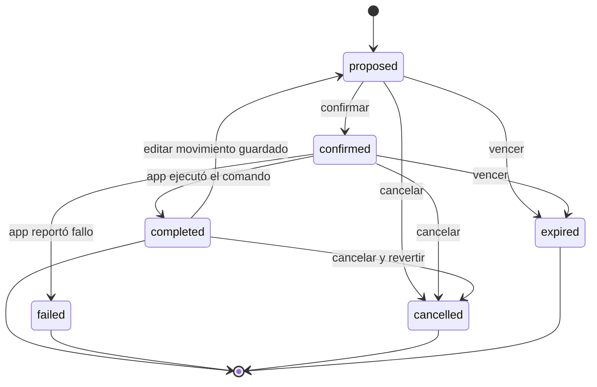

# Memoria del asistente

## Objetivo

La memoria permite continuar una conversación en varios dispositivos sin
mezclar usuarios y sin convertir inferencias temporales en datos permanentes.
No reemplaza el estado financiero: Room y `finance_sync_records` siguen siendo
las fuentes de la información económica.

Implementación de referencia:

- migración `20260728030000_assistant_memory.sql`;
- puerto `AssistantMemoryRepository`;
- adaptador `SupabaseAssistantMemoryRepository`;
- adaptador Koog `SupabaseKoogPersistenceStorageProvider`.

## Reglas obligatorias

1. La identidad siempre proviene del JWT validado por Supabase.
2. Los cuerpos HTTP nunca incluyen un `userId` como autoridad.
3. El backend usa la clave pública y el JWT del usuario; no usa `service_role`.
4. Todas las filas incluyen `user_id` y RLS.
5. Las relaciones hijas usan `(id, user_id)` para impedir referencias cruzadas.
6. Los mensajes y eventos son append-only.
7. El servicio solo interpreta y crea borradores. El cliente puede confirmar
   automáticamente movimientos reversibles; otras acciones requieren
   confirmación explícita.
8. Los cambios de estado usan control optimista con `version`.
9. Los checkpoints pertenecen a una conversación y expiran.
10. Los cuerpos, mensajes, JWT y estados financieros no aparecen en logs.

## Esquema

| Tabla | Responsabilidad | Escritura |
|---|---|---|
| `assistant_conversations` | Cabecera recuperable del chat. | Usuario autenticado. |
| `assistant_messages` | Historial append-only de usuario, asistente y herramientas. | Solo inserción. |
| `assistant_command_drafts` | Comando tipado que espera confirmación o resultado. | Inserción y transición controlada. |
| `assistant_command_events` | Auditoría automática de creación, edición y estado. | Solo triggers. |
| `assistant_product_aliases` | Alias confirmados por el usuario. | CRUD del propietario. |
| `assistant_checkpoints` | Estado serializado de Koog. | Upsert del propietario. |

Los identificadores se generan antes de escribir, lo que permite reintentos
idempotentes. Cada borrador tiene además una clave de idempotencia única por
usuario y un SHA-256 del JSON canónico del comando.

## Ciclo de un borrador



PostgreSQL rechaza cualquier transición diferente. El contenido del comando
puede editarse mientras está `proposed` o al reabrir explícitamente un
movimiento `completed`; esta reapertura limpia su resultado anterior y renueva
su vencimiento.
Completar exige `execution_result`; fallar exige `error_code`. Cada inserción o
actualización genera un evento en la misma transacción.

Los efectos de un movimiento autoguardado usan identificadores deterministas.
Editar elimina esos efectos locales, revisa el mismo borrador y vuelve a
ejecutarlo. Cancelar elimina el movimiento de Room y sus registros vinculados;
los triggers de outbox propagan la reversión a Supabase. Un mensaje con varias
acciones crea borradores independientes y Android los procesa en secuencia para
que editar o cancelar uno no altere los demás.
El autoguardado no depende de una sincronización previa: confirma el borrador,
ejecuta primero en Room y solicita la sincronización del outbox en segundo
plano. Una falla remota nunca convierte el movimiento en un formulario manual
ni muestra un botón de guardado.
En un turno múltiple Android trabaja en dos fases: primero confirma todos los
borradores contra la misma fotografía financiera y después ejecuta cada comando
en Room, respetando el orden del mensaje. La sincronización se solicita una sola
vez al terminar el lote. Nunca se confirma ni sincroniza un borrador después de
ejecutar otro del mismo turno, porque el primer movimiento cambiaría la versión
financiera y podría invalidar incorrectamente los movimientos restantes.
El historial recupera el `command_id` desde cualquier fila contable y abre el
mismo borrador remoto en un editor determinista independiente del chat; así las
correcciones de tarjetas, ahorros y préstamos siguen las reglas de dominio en
lugar de modificar únicamente el registro visible.

El intérprete recibe el catálogo sincronizado de categorías base y personales.
El modelo elige el identificador cuya etiqueta mejor represente el mensaje y el
servicio lo valida contra la fotografía financiera. `OTHER` es solo el respaldo
cuando no existe una asociación razonable. Las categorías personales son una
entidad del outbox y se sincronizan antes que los movimientos que las referencian.
Antes de enviar un turno nuevo, Android vacía la outbox pendiente para que el
servicio interprete productos y categorías recién creados. Si esa sincronización
falla, el turno no se envía con un contexto remoto obsoleto: el mensaje conserva
la opción de reintentar y Perfil muestra el error por encima del contador.

El backend filtra por `state` y `version` en el `PATCH`. Una respuesta vacía
significa conflicto: otro dispositivo modificó el borrador o ya no está en el
estado esperado.

## Checkpoints de Koog

`SupabaseKoogPersistenceStorageProvider` implementa
`PersistenceStorageProvider<AgentCheckpointPredicateFilter>`.

- La instancia queda ligada a un `AuthenticatedUser` y un `conversationId`.
- El `sessionId` recibido desde Koog debe coincidir con la conversación.
- Se usa el serializador oficial de `AgentCheckpointData`.
- El ID de fila se deriva de usuario, conversación y clave del checkpoint.
- Guardar de nuevo la misma clave hace upsert y no crea duplicados.
- La retención predeterminada es de siete días.

Esto permite reanudar el grafo sin que un checkpoint de otra conversación sea
elegible, aun dentro de la cuenta correcta.

## RLS y privilegios

Las políticas comparan siempre:

```sql
(select auth.uid()) is not null
and (select auth.uid()) = user_id
```

El rol `anon` no tiene privilegios sobre ninguna tabla. `authenticated` recibe
solo las operaciones necesarias:

- conversaciones, alias y checkpoints: CRUD;
- mensajes: `select` e `insert`;
- borradores: `select`, `insert` y `update`;
- eventos: únicamente `select`.

Las funciones de triggers y retención no son ejecutables por `anon` ni
`authenticated`. Las funciones `security definer` usan `search_path = ''` y
nombres de tabla completamente cualificados.

## Retención y borrado

Supabase Cron ejecuta cada hora:

```sql
select public.purge_expired_assistant_memory();
```

La función:

1. cambia a `expired` los borradores `proposed` o `confirmed` vencidos;
2. elimina checkpoints cuyo `expires_at` ya pasó;
3. elimina borradores terminales después de 90 días.

Los eventos de un borrador se eliminan en cascada junto con este. Las
conversaciones y mensajes no vencen automáticamente porque forman parte del
historial visible del usuario.

`DELETE /v1/assistant/conversations/{conversationId}` elimina en cascada:

- mensajes;
- borradores;
- eventos;
- checkpoints.

Los alias no se eliminan al borrar un chat porque son preferencias confirmadas.
Tienen su propio borrado.

## Contratos HTTP

```text
POST   /v1/assistant/conversations
GET    /v1/assistant/conversations
GET    /v1/assistant/conversations/{conversationId}
DELETE /v1/assistant/conversations/{conversationId}
POST   /v1/assistant/drafts/{draftId}/confirm
POST   /v1/assistant/drafts/{draftId}/cancel
POST   /v1/assistant/drafts/{draftId}/complete
```

`confirm`, `cancel` y `complete` exigen `expectedVersion`. Cancelar también
exige el estado esperado, porque puede partir de `proposed` o `confirmed`.

Errores estables:

| Código | HTTP | Significado |
|---|---:|---|
| `INVALID_REQUEST` | 400 | Contrato o identificador inválido. |
| `UNAUTHORIZED` | 401 | JWT inválido, expirado o rechazado por Supabase. |
| `NOT_FOUND` | 404 | La conversación no existe para ese usuario. |
| `MEMORY_CONFLICT` | 409 | Estado o versión cambió. |
| `MEMORY_UNAVAILABLE` | 503 | Supabase no pudo completar la operación. |

Los mensajes de error nunca incluyen el cuerpo devuelto por Supabase.

## Validación

Validación de base de datos:

```powershell
npx --yes supabase@latest migration list --linked
npx --yes supabase@latest inspect db table-stats --linked
npx --yes supabase@latest db lint --linked --level warning
```

Validación JVM desde `apps/mobile`:

```powershell
.\gradlew.bat :assistant-service:test
.\gradlew.bat :shared:testAndroidHostTest
.\gradlew.bat :app:testDebugUnitTest
.\gradlew.bat :app:assembleDebug
```

Las pruebas normales usan `MockEngine`; no llaman OpenAI ni escriben en
Supabase. Antes del merge se debe probar además con dos usuarios reales que una
cuenta no pueda leer, actualizar ni referenciar filas de la otra.
