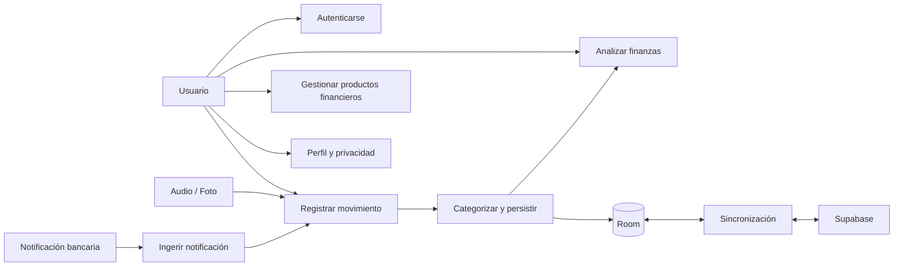
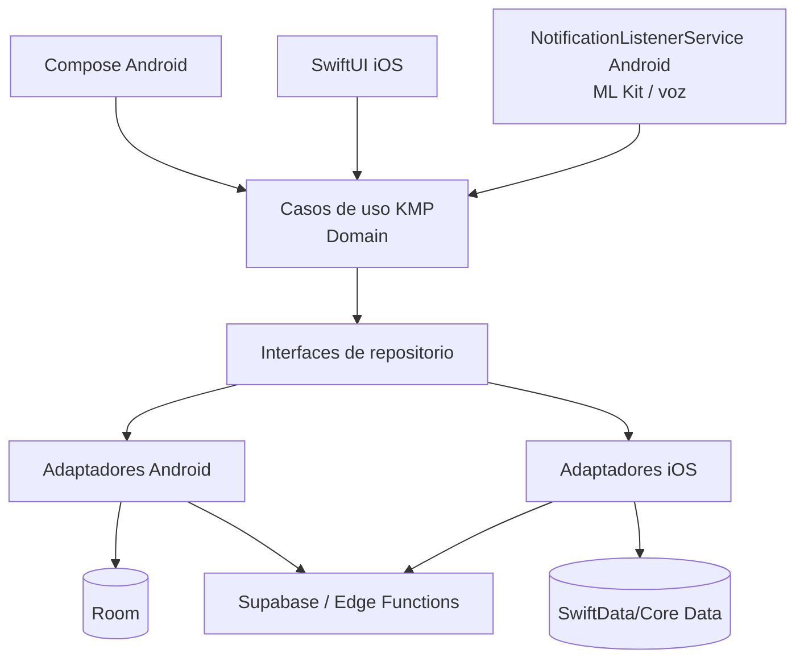
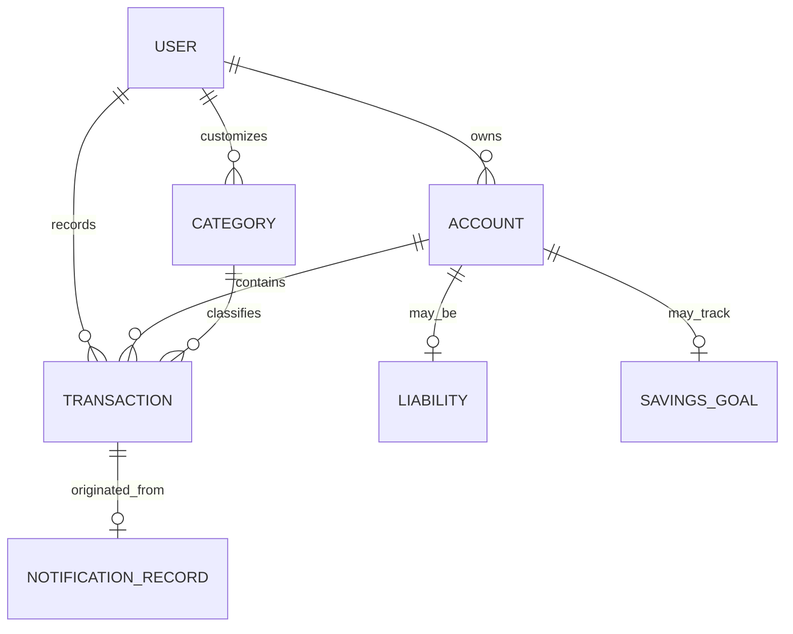
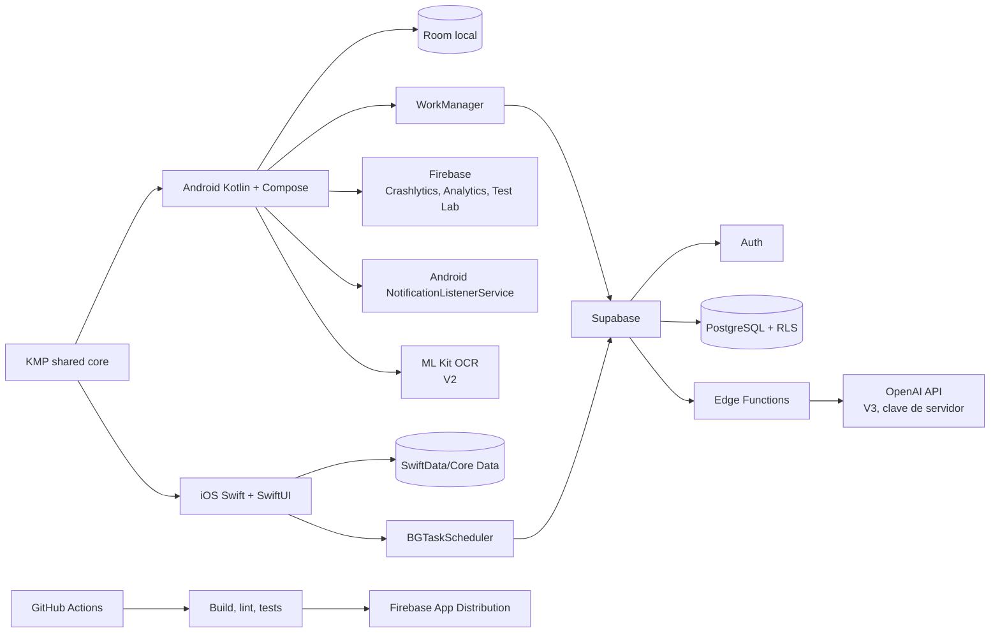

# PocketMind — Especificación de producto, arquitectura y calidad

> **Estado:** planificación inicial
> **Audiencia:** producto, desarrollo Android/iOS, QA, datos y seguridad.

Este documento convierte la visión de PocketMind en requisitos verificables.
Complementa el [plan de implementación](PLAN_IMPLEMENTACION.md): aquí se define
qué producto construiremos, cómo se organizará y cómo se comprobará su calidad
en Android e iOS.

## 1. Overview de la oportunidad

Administrar las finanzas personales no fracasa por falta de información, sino por
fricción. Una persona puede usar varios bancos, tarjetas, préstamos y cuentas de
ahorro. Cada aplicación bancaria muestra una parte aislada de la realidad y no
está diseñada para crear un hábito financiero diario. Registrar cada compra de
forma manual es repetitivo, lento y fácil de abandonar.

PocketMind aplica una capa de **facilidad, automatización y comprensión**. El
usuario conserva el control, pero no debe actuar como su propio contador: ambas
apps aceptan registros por texto, voz y foto; Android además detecta operaciones
desde notificaciones autorizadas. Las dos organizan el patrimonio y explican el
resultado con visualizaciones claras.

| Problema | Consecuencia actual | Respuesta de PocketMind |
|---|---|---|
| Varias entidades financieras | Visión fragmentada del dinero | Modelo unificado de cuentas, tarjetas, préstamos y ahorros |
| Apps bancarias poco amigables | El usuario evita revisar su situación | Dashboard simple, categorías y lenguaje cercano |
| Registro manual tedioso | Datos incompletos y abandono | Ingestión automática y captura por voz/foto |
| Conceptos bancarios crípticos | Comercios y gastos difíciles de entender | Normalización, reglas y correcciones persistentes |
| Falta de contexto | No se detectan hábitos | Análisis por periodo, categoría, cuenta y tendencia |

### Hipótesis de valor

Si PocketMind convierte la mayoría de notificaciones bancarias en movimientos
confiables y permite registrar el resto en segundos, el usuario tendrá datos
suficientemente completos para revisar y mejorar sus finanzas con menor esfuerzo.

### Principios de experiencia

1. Automático cuando sea confiable; explícito cuando no.
2. El usuario corrige y tiene la última palabra.
3. La información financiera se explica, no se juzga.
4. La aplicación sigue siendo útil sin internet.
5. La privacidad es una funcionalidad, no una nota legal.

## 2. Objetivo y alcance

### Estrategia de plataforma

Android e iOS son productos de primera clase con UI nativa: Jetpack Compose y
SwiftUI respectivamente. Kotlin Multiplatform (KMP) comparte modelos, reglas,
casos de uso y política de sincronización. Persistencia local, permisos,
navegación y APIs de sistema permanecen nativos.

| Capacidad | Android | iOS inicial |
|---|---|---|
| Autenticación, perfil, productos y dashboard | Sí | Sí |
| Registro manual, voz, foto/OCR e importaciones | Sí | Sí |
| Sincronización y análisis financiero | Sí | Sí |
| Notificaciones bancarias de terceros | Sí | No |

### Resultado esperado al terminar el desarrollo objetivo

El usuario podrá registrarse o iniciar sesión con correo/contraseña o Google,
recuperar y cambiar la contraseña, gestionar perfil y preferencias, y mantener
sus datos sincronizados. Podrá crear, editar, buscar, categorizar y analizar
ingresos y egresos; administrar cuentas, ahorros, tarjetas y préstamos; y
registrar movimientos manualmente, por voz, por foto o desde notificaciones
bancarias autorizadas.

### Métricas iniciales a validar

| Métrica | Definición |
|---|---|
| Activación | Usuario que completa onboarding y configura una fuente de registro |
| Automatización útil | Movimientos automáticos no corregidos o confirmados |
| Completitud | Días con movimientos registrados frente a actividad percibida |
| Retención | Usuarios que vuelven en semana 1 y semana 4 |
| Confianza | Correcciones, descartes y duplicados por parser y banco |

No se enviarán montos, texto de notificaciones, tokens ni PII a analítica.

## 3. Actores y casos de uso

| Actor | Necesidad principal |
|---|---|
| Usuario individual | Comprender su dinero sin registro exhaustivo manual |
| Usuario multibanco | Consolidar operaciones de distintas cuentas y productos |
| Usuario que inicia un hábito | Correcciones rápidas y explicaciones claras |
| Sistema bancario | Emite notificaciones; no recibe acciones de PocketMind |
| Supabase | Autenticación, sincronización y funciones de backend |
| Servicios OCR/IA | Interpretan datos minimizados, solo con consentimiento |



| ID | Caso de uso | Resultado |
|---|---|---|
| UC-01 | Autenticarse | Sesión segura con correo/contraseña o Google |
| UC-02 | Registrar movimiento | Movimiento manual, hablado, visual o automático |
| UC-03 | Gestionar patrimonio | Cuentas, ahorros, tarjetas y préstamos actualizados |
| UC-04 | Corregir y buscar | Datos confiables y fáciles de encontrar |
| UC-05 | Analizar finanzas | Balance, hábitos, deuda, ahorro y tendencias |

## 4. Requisitos funcionales

| ID | Requisito | Prioridad |
|---|---|---|
| RF-01 | Registro, inicio/cierre de sesión y sesión segura | MVP |
| RF-02 | Inicio con Google mediante Supabase Auth | MVP |
| RF-03 | Recuperación y cambio de contraseña | MVP |
| RF-04 | Consulta y edición de perfil y preferencias | MVP |
| RF-05 | Alta, edición, eliminación y consulta de ingresos/egresos | MVP |
| RF-06 | Categorías, comercios y corrección manual persistente | MVP |
| RF-07 | Registro por lenguaje natural escrito y hablado | MVP incremental |
| RF-08 | Lectura de notificaciones bancarias autorizadas, solo Android | MVP Android |
| RF-09 | Gestión de cuentas, ahorros, tarjetas y préstamos | MVP |
| RF-10 | Dashboard, gráficas, estadísticas, historial y búsqueda | MVP |
| RF-11 | Sincronización offline-first de persistencia local/Supabase | MVP |
| RF-12 | Captura y extracción desde foto/recibo | V2 |
| RF-13 | Importación PDF, Excel/CSV y extractos | V2 |
| RF-14 | Presupuestos, metas, alertas y suscripciones | V2 |
| RF-15 | Consultas y recomendaciones de IA | V3 |

## 5. Requisitos no funcionales

| ID | Requisito verificable |
|---|---|
| RNF-01 | La persistencia local nativa es fuente de verdad de la UI; consulta y registro funcionan sin red. |
| RNF-02 | Ningún secreto se distribuye en APK, repositorio o `BuildConfig` de producción. |
| RNF-03 | Todas las tablas remotas aplican RLS: un usuario no accede a datos de otro. |
| RNF-04 | Ingestión y sincronización son idempotentes y toleran reintentos. |
| RNF-05 | La UI representa carga, vacío, error y reintento. |
| RNF-06 | No hay I/O ni parsing costoso en hilo principal; tareas diferidas usan WorkManager. |
| RNF-07 | TalkBack, contraste AA, texto escalable y objetivos de 48dp. |
| RNF-08 | No hay PII, montos ni texto de notificación en logs o analítica. |
| RNF-09 | Cada migración de persistencia local Android/iOS tiene prueba automatizada. |
| RNF-10 | Clean Architecture, MVVM, StateFlow y dependencias inyectadas. |
| RNF-11 | Cada PR ejecuta formato, análisis estático, unit tests y build. |
| RNF-12 | Se prueban permisos y tareas de fondo en emulador y dispositivos físicos. |

## 6. Historias de usuario y pruebas unitarias

Las historias son trazables por ID. La tabla de cada historia define la prueba
unitaria mínima; cada defecto agrega un caso de regresión.

### HU-001 — Inicio de sesión

**Como** usuario, **quiero** iniciar sesión, **para** acceder a mi información
financiera sincronizada.

**Aceptación:** credenciales válidas abren sesión; contraseña incorrecta,
usuario inexistente, campos vacíos y cuenta bloqueada muestran un error seguro;
un token inválido no queda almacenado.

**Componentes:** `AuthRepository`, `SignInUseCase`, `PasswordValidator`,
`AuthViewModel`, `SessionManager`.

| Clase | Casos unitarios mínimos |
|---|---|
| `PasswordValidator` | contraseña válida; inválida; campo vacío |
| `SignInUseCase` | éxito; usuario inexistente; cuenta bloqueada |
| `AuthViewModel` | loading a success; error de credenciales |
| `SessionManager` | guarda sesión válida; limpia token inválido |

### HU-002 — Registro y acceso con Google

**Como** visitante, **quiero** crear una cuenta con correo o Google, **para**
empezar sin fricción.

**Aceptación:** correo y contraseña válidos crean cuenta; correo existente se
informa; Google exitoso crea o recupera perfil; cancelación o token inválido no
crea sesión parcial.

**Componentes:** `SignUpUseCase`, `GoogleSignInCoordinator`,
`CreateUserProfileUseCase`.

| Clase | Casos unitarios mínimos |
|---|---|
| `EmailValidator` | correo válido; formato inválido; vacío |
| `SignUpUseCase` | registro exitoso; correo duplicado; contraseña débil |
| `GoogleSignInCoordinator` | éxito; cancelación; token de identidad inválido |
| `CreateUserProfileUseCase` | crea perfil; no duplica perfil existente |

### HU-003 — Recuperar y cambiar contraseña

**Como** usuario, **quiero** recuperar y cambiar mi contraseña, **para**
mantener acceso a mi cuenta.

**Aceptación:** una solicitud válida envía enlace sin revelar si la cuenta existe;
la nueva contraseña cumple política; confirmación distinta falla; sesión vencida
requiere reautenticación.

**Componentes:** `RequestPasswordResetUseCase`, `ChangePasswordUseCase`,
`PasswordPolicy`.

| Clase | Casos unitarios mínimos |
|---|---|
| `PasswordPolicy` | longitud; complejidad; confirmación coincidente |
| `RequestPasswordResetUseCase` | solicitud aceptada; error remoto normalizado |
| `ChangePasswordUseCase` | éxito; sesión vencida; política inválida |

### HU-004 — Perfil y preferencias

**Como** usuario, **quiero** gestionar mi perfil y preferencias, **para**
personalizar la experiencia y controlar mis datos.

**Aceptación:** edita nombre, moneda, zona horaria y preferencias; datos inválidos
no se guardan; cambio local se sincroniza; el usuario puede solicitar cierre o
borrado de cuenta según política.

**Componentes:** `ProfileRepository`, `UpdateProfileUseCase`,
`PreferencesRepository`, `DeleteAccountUseCase`.

| Clase | Casos unitarios mínimos |
|---|---|
| `ProfileValidator` | nombre válido; vacío; moneda no soportada |
| `UpdateProfileUseCase` | actualización local; cola sync; error recuperable |
| `DeleteAccountUseCase` | confirma intención; borra sesión; solicita borrado remoto |

### HU-005 — Movimiento manual

**Como** usuario, **quiero** registrar un ingreso o egreso manual, **para**
completar información que no proviene del banco.

**Aceptación:** monto positivo, tipo, fecha y categoría obligatorios; comercio y
nota opcionales; aparece inmediatamente offline; editar o eliminar actualiza
estadísticas y sincronización.

**Componentes:** `CreateTransactionUseCase`, `UpdateTransactionUseCase`,
`DeleteTransactionUseCase`, `TransactionValidator`.

| Clase | Casos unitarios mínimos |
|---|---|
| `TransactionValidator` | ingreso válido; egreso válido; monto cero/negativo; fecha inválida |
| `CreateTransactionUseCase` | persiste local; encola sync; conserva origen manual |
| `UpdateTransactionUseCase` | marca edición manual; recalcula derivados |
| `DeleteTransactionUseCase` | elimina local; encola tombstone; no elimina ajeno |

### HU-006 — Registro por voz y lenguaje natural

**Como** usuario, **quiero** decir “gasté 35 mil en almuerzo”, **para** registrar
un movimiento sin llenar un formulario.

**Aceptación:** solicita micrófono antes de grabar; muestra transcripción para
confirmación; extrae monto, tipo, comercio y fecha cuando es posible; una
ambigüedad se revisa antes de guardar.

**Componentes:** `VoiceCaptureCoordinator`, `NaturalLanguageTransactionParser`,
`CreateDraftTransactionUseCase`.

| Clase | Casos unitarios mínimos |
|---|---|
| `NaturalLanguageTransactionParser` | gasto COP; ingreso; fecha relativa; monto ambiguo; texto no interpretable |
| `VoiceCaptureCoordinator` | permiso concedido; denegado; transcripción vacía |
| `CreateDraftTransactionUseCase` | borrador confiable; pendiente de revisión |

### HU-007 — Registro desde foto

**Como** usuario, **quiero** fotografiar un recibo, **para** registrar compras sin
transcribirlas.

**Aceptación:** cámara solo al usarla; OCR extrae texto con calidad suficiente;
se muestra borrador editable; imagen ilegible no crea transacción falsa.

**Componentes:** `ReceiptOcrDataSource`, `ReceiptParser`,
`CreateReceiptDraftUseCase`.

| Clase | Casos unitarios mínimos |
|---|---|
| `ReceiptParser` | monto/comercio; múltiples montos; recibo ilegible |
| `CreateReceiptDraftUseCase` | borrador válido; confianza baja; imagen sin texto |
| `ImagePrivacyPolicy` | elimina temporal; no persiste sin consentimiento |

> La foto/OCR es V2, pero su contrato se define ahora para no modificar el
> modelo de transacciones después.

### HU-008 — Registro automático desde notificaciones

**Como** usuario, **quiero** que PocketMind interprete notificaciones bancarias
autorizadas, **para** evitar registrar manualmente la mayoría de operaciones.

**Aceptación:** solo procesa paquetes permitidos; extrae tipo, monto y comercio
cuando hay confianza; eventos repetidos no duplican; una ambigüedad queda en
revisión; desactivar el listener se informa sin bloquear la aplicación.

**Componentes:** `NotificationListenerService`, `BankNotificationParser`,
`BancolombiaParser`, `TransactionDeduplicator`, `IngestNotificationUseCase`.

| Clase | Casos unitarios mínimos |
|---|---|
| `BancolombiaParser` | compra; ingreso; reversión; monto COP; formato desconocido |
| `TransactionDeduplicator` | duplicado exacto; mismo monto distinto evento; ventana temporal |
| `IngestNotificationUseCase` | banco permitido; ignorado; baja confianza; persistencia atómica |
| `NotificationPermissionState` | concedido; listener desactivado; acceso revocado |

### HU-009 — Categorías y comercios

**Como** usuario, **quiero** corregir categoría y comercio, **para** que mi
análisis refleje la realidad y mejore las sugerencias futuras.

**Aceptación:** las categorías son seleccionables; corregir un movimiento no
altera otros sin confirmación; corrección manual prevalece; se conservan alias de
comercio.

**Componentes:** `CategoryRepository`, `MerchantNormalizer`,
`ClassifyTransactionUseCase`, `ApplyManualCorrectionUseCase`.

| Clase | Casos unitarios mínimos |
|---|---|
| `MerchantNormalizer` | normaliza alias; conserva desconocido; no vacía comercio |
| `ClassifyTransactionUseCase` | regla conocida; sin regla; confianza baja |
| `ApplyManualCorrectionUseCase` | prevalencia manual; regla aprendida opcional; sync correcto |

### HU-010 — Cuentas y ahorros

**Como** usuario, **quiero** gestionar mis cuentas y ahorros, **para** conocer mi
liquidez y avance hacia una reserva.

**Aceptación:** crea cuentas con tipo, saldo y moneda; ahorros se separan de
gastos; transferencias internas no alteran patrimonio; saldo y movimiento son
consistentes.

**Componentes:** `AccountRepository`, `SavingsRepository`,
`TransferFundsUseCase`, `CalculateNetBalanceUseCase`.

| Clase | Casos unitarios mínimos |
|---|---|
| `AccountValidator` | cuenta válida; saldo inválido; moneda incompatible |
| `TransferFundsUseCase` | transferencia válida; fondos insuficientes; operación atómica |
| `CalculateNetBalanceUseCase` | suma cuentas/ahorros; excluye transferencia duplicada |

### HU-011 — Préstamos y tarjetas

**Como** usuario, **quiero** administrar préstamos y tarjetas, **para** conocer
mis obligaciones y su impacto mensual.

**Aceptación:** almacena saldo, límite, cuota, tasa y fechas aplicables; un pago
de tarjeta o préstamo se distingue de una compra; dashboard muestra deuda y
utilización; datos incompletos son visibles.

**Componentes:** `LiabilityRepository`, `CreditCardCalculator`,
`LoanPaymentUseCase`, `DebtSummaryUseCase`.

| Clase | Casos unitarios mínimos |
|---|---|
| `CreditCardCalculator` | utilización; límite cero; sobrecupo |
| `LoanPaymentUseCase` | abono reduce saldo; interés/capital; pago mayor al saldo |
| `DebtSummaryUseCase` | suma obligaciones; separa deuda y gasto; datos faltantes |

### HU-012 — Historial, búsqueda y filtros

**Como** usuario, **quiero** buscar y filtrar movimientos, **para** encontrar y
verificar rápidamente una operación.

**Aceptación:** filtra por periodo, tipo, categoría, producto, comercio y monto;
búsqueda ignora mayúsculas; filtros combinados son consistentes; listas grandes
usan consulta eficiente.

**Componentes:** `SearchTransactionsUseCase`, `TransactionFilter`,
`TransactionDao`.

| Clase | Casos unitarios mínimos |
|---|---|
| `TransactionFilter` | cada filtro; combinación; rango límite; consulta vacía |
| `SearchTransactionsUseCase` | comercio normalizado; sin resultados; orden por fecha |
| `TransactionDao` | paginación; índice de consulta; Flow actualizado |

### HU-013 — Dashboard y análisis

**Como** usuario, **quiero** ver un dashboard de mis finanzas, **para** entender
balance, hábitos y cambios sin calcular manualmente.

**Aceptación:** periodo explícito; ingresos, egresos, saldo, ahorro, deuda y
categorías visibles; tocar gráfica lleva al detalle; categorías suman el total
aplicable; sin datos no se muestran conclusiones falsas.

**Componentes:** `DashboardViewModel`, `GetFinancialSummaryUseCase`,
`GetSpendingByCategoryUseCase`, `GetTrendUseCase`.

| Clase | Casos unitarios mínimos |
|---|---|
| `GetFinancialSummaryUseCase` | periodo normal; sin movimientos; transferencias excluidas |
| `GetSpendingByCategoryUseCase` | distribución; categoría sin gasto; redondeo consistente |
| `GetTrendUseCase` | periodos completos; datos parciales; orden cronológico |
| `DashboardViewModel` | carga; contenido; error; cambio de periodo |

### HU-014 — Sincronización y trabajo offline

**Como** usuario, **quiero** que mis datos funcionen sin red y se sincronicen
luego, **para** no perder registros ni depender de conectividad.

**Aceptación:** cambio aparece localmente sin red; se encola y reintenta; no se
duplica; conflicto con edición manual favorece al usuario; estado de sincronización
es consultable.

**Componentes:** `SyncRepository`, `SyncWorker`, `OutboxDao`,
`ConflictResolver`.

| Clase | Casos unitarios mínimos |
|---|---|
| `OutboxRepository` | encola create/update/delete; no duplica operación idempotente |
| `ConflictResolver` | manual vs automático; remoto válido; conflicto no resoluble |
| `SyncWorker` | sin red; éxito; error transitorio; error definitivo |

### HU-015 — Privacidad y consentimiento

**Como** usuario, **quiero** entender y controlar permisos y datos, **para**
utilizar la automatización con confianza.

**Aceptación:** antes de leer notificaciones se explica propósito; usuario ve y
revoca permiso; puede solicitar borrado de cuenta; no se transmite contenido sin
base funcional y consentimiento aplicable.

**Componentes:** `ConsentRepository`, `NotificationAccessChecker`,
`PrivacySettingsViewModel`, `DataDeletionUseCase`.

| Clase | Casos unitarios mínimos |
|---|---|
| `ConsentRepository` | guarda consentimiento; versión política; revocación |
| `NotificationAccessChecker` | activo; inactivo; paquete no autorizado |
| `DataDeletionUseCase` | confirmación; limpieza local; solicitud remota |

## 7. Arquitectura de software

### Capas y flujo de datos



Compose y SwiftUI solo renderizan estado y emiten eventos. Los casos de uso KMP
no dependen de UI ni de APIs de un sistema operativo. Cada plataforma implementa
sus repositorios locales y adaptadores de permisos.

### Estructura modular prevista

```text
shared/
  core/                modelos, validaciones, cálculos y casos de uso KMP
  data/                DTOs, mapeadores, contratos y política de sincronización
  testing/             fixtures, builders y fakes compartidos
androidApp/
  app/                 Compose, Hilt, navegación y features Android
  database/            Room, DAO y migraciones
  notification/        listener y parsers bancarios Android
iosApp/
  PocketMind/          SwiftUI, navegación y composición de dependencias
  Persistence/         SwiftData/Core Data y migraciones
```

### Modelo de dominio inicial



Entidades: `Transaction`, `Account`, `Liability`, `SavingsGoal`, `Category`,
`Merchant`, `NotificationRecord`, `SyncOperation`, `UserProfile` y `Consent`.
Una transacción incluye origen (`MANUAL`, `VOICE`, `RECEIPT`, `NOTIFICATION`,
`IMPORT`), confianza y marca de edición manual.

## 8. Infraestructura y stack



| Área | Decisión |
|---|---|
| Aplicación | KMP compartido; Compose Android y SwiftUI iOS; Clean Architecture |
| Estado | Coroutines/Flow compartidos; ViewModel Android y estado SwiftUI iOS |
| DI / navegación | Hilt/Navigation Compose Android; composición/NavigationStack iOS |
| Persistencia | Room Android; SwiftData/Core Data iOS; almacenamiento seguro por plataforma |
| Sincronización | Supabase Auth, PostgreSQL, RLS, Edge Functions, WorkManager/BGTaskScheduler |
| Notificaciones | `NotificationListenerService` y parsers, exclusivamente Android |
| Voz / OCR | APIs nativas y ML Kit/alternativa iOS, con confirmación humana |
| IA | OpenAI desde Edge Functions, nunca directamente desde APK |
| Calidad | JUnit, MockK/fakes, Turbine, Compose UI Test, Maestro/Espresso |
| Observabilidad | Firebase Crashlytics/Analytics sin PII; GitHub Actions |

| Entorno | Propósito | Restricción |
|---|---|---|
| `debug` | Desarrollo local | Logs seguros, sin datos reales |
| `staging` | QA e integración | RLS y migraciones equivalentes a producción |
| `release` | Usuarios finales | R8, logs restringidos, secretos fuera del cliente |

## 9. Seguridad, privacidad y resiliencia

- Solicitar permisos en contexto, siempre después de explicar su beneficio.
- Filtrar paquetes bancarios permitidos; no procesar todas las notificaciones.
- Minimizar datos, usar almacenamiento seguro para tokens y no guardar contraseñas.
- Aplicar RLS y validación de propiedad a cada recurso remoto.
- Usar Edge Functions para IA, con rate limit y minimización de contexto.
- Mostrar estado de sincronización y reintentar con backoff.
- No ofrecer asesoría financiera como hecho; presentar análisis como información.
- Documentar borrado de cuenta, retención y recuperación de errores antes de publicar.

## 10. Estrategia integral de pruebas

```text
                 E2E / dispositivo real  (flujos críticos)
              -----------------------------------------------
                Integración (persistencia local por plataforma, sync, contratos)
          ------------------------------------------------------
           Unitarias (parsers, casos de uso, ViewModels, reglas)
```

| Nivel | Proporción objetivo | Herramientas | Puerta de calidad |
|---|---:|---|---|
| Unitarias | ~70% | JUnit, MockK/fakes, Turbine | Cada caso de uso y regla crítica |
| Integración | ~20% | Room/SwiftData tests, WorkManager/BGTask tests, fakes | Migraciones, sync y repositorios |
| UI/E2E | ~10% | Compose UI Test, XCTest/XCUITest, Maestro | Login, onboarding, registro y dashboard |
| Manual | Según riesgo | Android Studio, Xcode, dispositivos y Test Lab | Permisos, OEM, batería, cámara y voz |

### Diseño de datos de prueba

- Builders para usuario, cuenta, transacción, producto y notificación.
- Notificaciones anonimizadas por banco y versión de formato.
- Reloj inyectable para fechas, deduplicación y periodos.
- Fakes de red, autenticación, OCR, voz y conectividad; nunca producción.
- Datos deterministas, sin PII ni credenciales.

### Pruebas de integración obligatorias

1. Las migraciones Room Android y SwiftData/Core Data iOS preservan transacciones.
2. Repositorio cache-first emite local y después remoto sin bloquear UI.
3. `SyncWorker` reintenta una operación sin crear duplicados.
4. RLS de staging impide leer o modificar recursos de otro usuario.
5. Parser y deduplicador crean exactamente un movimiento por evento válido.
6. Una edición manual sobrevive a sincronización y reclasificación.

### Flujos E2E de salida

1. Registro → onboarding → permiso o rechazo de notificaciones → dashboard vacío.
2. Inicio de sesión → egreso manual → historial y gráfica actualizados.
3. Notificación Bancolombia → movimiento categorizado o revisión pendiente.
4. Sin red → registro manual → reconexión → sincronización confirmada.
5. Corrección de categoría → dashboard actualizado → persistencia tras reinicio.
6. Recuperación y cambio de contraseña.

### Matriz de dispositivos

- Android: emuladores 320dp, 360dp, 411dp, tablet y fuente grande; Samsung,
  Xiaomi/MIUI y un equipo de gama media físicos.
- iOS: simuladores y al menos un iPhone físico; Dynamic Type, VoiceOver, cámara,
  voz y permisos.
- El listener bancario, optimización de batería y WorkManager se prueban solo en
  Android; sincronización y reglas compartidas se prueban en ambas plataformas.

## 11. Criterios de salida y orden de entrega

Una historia está terminada solo si cumple aceptación, incluye las pruebas
definidas, representa estados de carga/vacío/error, cumple accesibilidad y
privacidad, pasa CI y documenta cambios de API o base de datos. Todo cambio de
esquema incluye migración y prueba de migración.

Orden recomendado:

1. Fundaciones: KMP, CI Android/iOS, design systems, persistencia por plataforma,
   Supabase, sesión y seguridad.
2. HU-001 a HU-004: identidad, perfil y preferencias.
3. HU-005, HU-009 y HU-012: movimientos manuales, categorías e historial.
4. HU-010 y HU-011: cuentas, ahorros, tarjetas y préstamos.
5. HU-013 y HU-014: dashboard y sincronización offline-first.
6. HU-008: notificaciones Bancolombia y endurecimiento Android en dispositivos reales.
7. HU-006: voz; HU-007: foto/OCR como evolución V2.
8. HU-015, auditoría, E2E, rendimiento y despliegue controlado.

La IA conversacional se introduce después de consolidar calidad de datos. No
reemplaza reglas deterministas ni la corrección del usuario.
