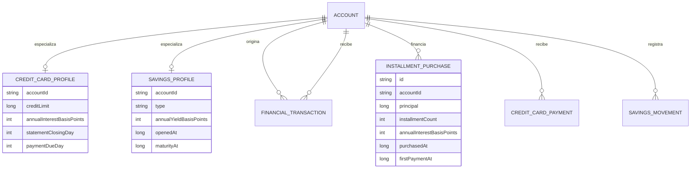

# Núcleo financiero manual

> Estado: base funcional previa a automatización, recordatorios y lectura de
> notificaciones.

Este documento define las reglas del producto manual de PocketMind. Es la
referencia para Android y para la futura implementación equivalente en iOS.

## Alcance

La persona puede:

- registrar varias cuentas bancarias, efectivo, préstamos, tarjetas de crédito
  y productos de ahorro;
- editar la información principal de cada producto;
- registrar ingresos, gastos y transferencias manuales;
- registrar compras de tarjeta a una o varias cuotas;
- registrar pagos de tarjeta y relacionarlos con la cuenta desde la que salen;
- registrar aportes, retiros y cambios de tasa en ahorros;
- consultar un panorama general, el detalle por producto y el historial
  filtrado;
- consultar un análisis mensual básico por categoría.

La lectura de notificaciones, los recordatorios, voz, OCR y sincronización
financiera remota quedan fuera de este incremento. Se construirán sobre este
libro local sin cambiar sus reglas contables.

## Modelo



`FinancialAccount` mantiene la identidad compartida. Los detalles que solo
aplican a una tarjeta o ahorro viven en perfiles especializados. Las compras,
pagos y cambios de tasa conservan historial; no se reemplazan por un saldo
editable sin origen.

## Reglas contables

### Cuentas y efectivo

```text
saldo = saldo inicial
      + ingresos
      - gastos
      + transferencias recibidas
      - transferencias enviadas
```

### Panorama

```text
activos = efectivo + cuentas bancarias + ahorros proyectados
pasivos = tarjetas de crédito + préstamos
patrimonio estimado = activos - pasivos
```

El ingreso y gasto mensual excluye transferencias, aportes a ahorro y pagos de
deuda para evitar duplicar flujos internos.

### Tarjetas

- La deuda inicial es el saldo registrado al crear la tarjeta.
- Cada compra conserva principal, tasa, cantidad de cuotas y primera fecha de
  pago.
- Para tasa cero, la cuota es `principal / cuotas`.
- Con tasa, se usa una cuota fija calculada con la tasa mensual equivalente de
  la tasa efectiva anual.
- La deuda actual es deuda inicial más valores financiados menos pagos.
- Los pagos se distribuyen cronológicamente entre cuotas pendientes. Cuando
  todas las cuotas de una compra quedan cubiertas, se muestra como pagada.
- El cupo disponible nunca puede quedar por debajo de cero y una compra que
  supera el cupo se rechaza.

Los valores son estimaciones de organización personal. El extracto oficial del
banco prevalece porque pueden existir seguros, impuestos, avances o reglas
contractuales no registradas.

### Ahorros

- `SIMPLE`: saldo sin necesidad de rendimiento.
- `POCKET`: ahorro flexible con tasa modificable.
- `TERM_DEPOSIT`: ahorro con tasa y vencimiento.
- Aportes y retiros son eventos inmutables.
- Un cambio de tasa aplica desde su fecha y no altera el rendimiento histórico.
- La proyección usa capitalización diaria equivalente a la tasa efectiva anual.
- Un retiro mayor al saldo proyectado se rechaza.

El rendimiento mostrado es estimado; no sustituye el saldo certificado por la
entidad financiera.

### Transferencias

Una transferencia es un único movimiento con cuenta de origen y destino. Reduce
una cuenta y aumenta la otra, pero no se suma como ingreso ni gasto. Pagos de
tarjeta y aportes de ahorro usan esta regla cuando la persona selecciona una
cuenta relacionada.

## Experiencia

- Inicio muestra primero patrimonio, ingresos y gastos del mes.
- El carrusel contiene panorama general y un resumen por producto.
- Cada producto abre su detalle.
- Las acciones rápidas de gasto, ingreso, tarjetas, ahorros, cuentas e historial
  navegan a una experiencia real.
- Formularios usan etiquetas persistentes, ejemplos, validación recuperable y
  una acción primaria.
- Toda pantalla con escritura usa `adjustResize`, contenido desplazable e
  `imePadding`; el teclado no debe ocultar el campo activo ni el botón de
  guardado.

## Arquitectura

- Los modelos y cálculos puros viven en `shared/commonMain` para ser reutilizados
  por Android e iOS.
- Room es la fuente local de verdad de la interfaz Android.
- Los ViewModels exponen `StateFlow` inmutable y coordinan repositorios/casos de
  uso.
- Las pantallas Compose reciben estado y eventos; no ejecutan cálculos
  financieros ni consultas.
- La migración Room `2 → 3` conserva datos previos y convierte ahorros y deudas
  del onboarding en productos visibles.
- Las futuras notificaciones crearán candidatos revisables que, después de la
  confirmación, escribirán en los mismos contratos del dominio.

## Pruebas mínimas

| Componente | Casos |
|---|---|
| Cuotas | tasa cero; tasa positiva; varias compras; compra finalizada |
| Tarjeta | deuda inicial; cupo; pago parcial; pago total; exceso de cupo |
| Ahorro | sin tasa; rendimiento anual; aporte; retiro; cambio de tasa |
| Transferencia | origen disminuye; destino aumenta; no altera ingresos/gastos |
| Room | migración 2→3; claves foráneas; datos del onboarding conservados |
| UI | vacío, contenido, error, texto ampliado, oscuro y teclado abierto |

## Límites conocidos antes de automatización

- Los cálculos dependen de los datos ingresados por la persona.
- No se concilia todavía contra extractos bancarios.
- No hay recordatorios ni generación automática de cuotas mensuales como
  movimientos; el calendario es una proyección visible.
- Los productos financieros siguen almacenados localmente. La sincronización con
  Supabase debe conservar IDs, historial y prioridad de edición manual.
