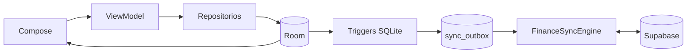

# ADR-001 — Sincronización financiera offline-first

- **Estado:** aceptada e implementada en Android
- **Fecha:** 2026-07-27
- **Alcance:** persistencia financiera manual de PocketMind

## Contexto

PocketMind debe permitir consultar y modificar las finanzas sin Internet, no
perder cambios si el proceso se detiene y mantener una cuenta consistente al
usarla en varios dispositivos. Los repositorios Android ya escriben en Room y
la interfaz observa esos datos localmente.

## Decisión

Room es la única fuente de verdad de la interfaz Android. Supabase es la copia
remota por usuario y el punto de convergencia entre dispositivos. Ninguna
pantalla consulta PostgreSQL directamente.

Cada cambio en una entidad financiera genera, mediante un trigger SQLite, una
operación coalescida en `sync_outbox` dentro de la misma transacción. El motor:

1. envía primero las operaciones locales pendientes;
2. conserva tombstones remotos para comunicar eliminaciones;
3. descarga el snapshot remoto completo del usuario;
4. comprueba otra vez que no aparecieron cambios locales durante la descarga;
5. reemplaza atómicamente el snapshot local sin reencolarlo;
6. actualiza el estado observable de sincronización.

## Modelo remoto

`public.finance_sync_records` almacena un sobre por
`(user_id, entity_type, entity_id)`:

- `payload`: JSON tipado de una entidad activa;
- `schema_version`: versión del contrato del payload;
- `is_deleted`: tombstone; cuando es verdadero, `payload` debe ser nulo;
- `updated_at_epoch_millis`: tiempo asignado por PostgreSQL.

Esta representación permite añadir tipos locales sin migrar una tabla remota
por cada entidad. Si análisis SQL intensivo lo requiere, se crearán
proyecciones normalizadas derivadas; la tabla de sync no sustituye el modelo de
dominio.

## Seguridad

- RLS está habilitado y no se considera opcional.
- `SELECT`, `INSERT` y `UPDATE` requieren rol `authenticated`.
- Todas las políticas comprueban que `auth.uid()` no sea nulo y coincida con
  `user_id`.
- La clave de servicio no se distribuye en la aplicación.
- Al cambiar de cuenta se elimina atómicamente el caché financiero anterior.
- Al cerrar sesión, PocketMind no permite perder cambios pendientes: exige
  sincronizarlos antes de limpiar el dispositivo.

## Conflictos y consistencia

La consistencia es eventual. Para la base manual se adopta **última escritura
recibida por el servidor**. Una edición posterior puede reactivar una entidad
eliminada desde otro dispositivo; esto se considera una recuperación
intencional y deberá mostrarse en un historial de auditoría en una fase futura.

No se aplica un snapshot remoto si apareció una nueva escritura local durante
su descarga. El trabajo falla de forma segura y WorkManager lo reintenta.

## Activación y reintentos

- inmediatamente al aparecer una operación en la outbox;
- después de autenticar, antes de abrir los datos del usuario;
- al llevar la aplicación a primer plano;
- periódicamente cada 15 minutos con red;
- manualmente desde Perfil.

WorkManager exige conectividad y limita los reintentos. La falta de red no
bloquea el uso local.

## Migración de instalaciones existentes

Al actualizar desde Room 4:

- se preservan todos los datos financieros;
- se crean `sync_control`, `sync_outbox` y los triggers;
- la primera cuenta autenticada adopta y encola los datos locales existentes;
- una cuenta distinta nunca hereda el caché de la cuenta anterior.

## Consecuencias

### Positivas

- escrituras instantáneas y disponibles offline;
- no se necesita duplicar lógica de sync en cada repositorio;
- reintentos idempotentes;
- eliminaciones consistentes entre dispositivos;
- evolución remota compatible mediante `schema_version`.

### Costes y límites aceptados

- se descarga el snapshot financiero completo por sincronización;
- no hay actualización en tiempo real mientras la app está abierta;
- el modelo de conflicto no combina campos concurrentes;
- iOS deberá implementar su propia outbox local y respetar el mismo contrato
  remoto.

Se revisará el snapshot completo cuando un usuario pueda superar 10.000
registros activos o las métricas indiquen transferencias excesivas. La
evolución prevista es sync incremental por cursor, sin cambiar la fuente local
de verdad.
